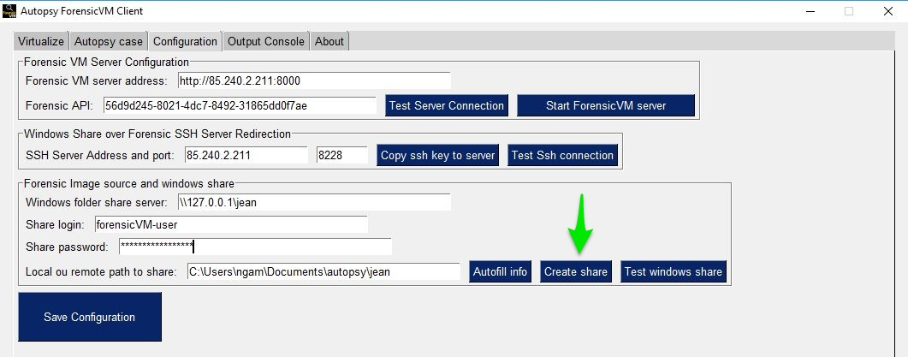
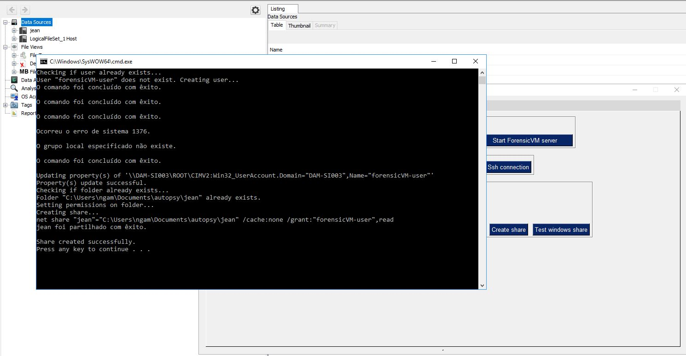
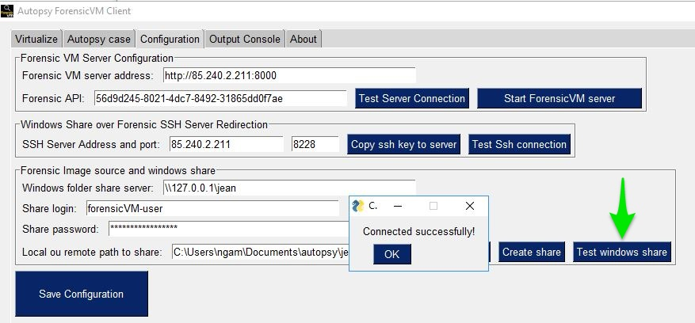

=====================
Installation and Setup
=====================
This section will guide you through the steps necessary to install and set up ForensicVM on your system.

Installation Steps
------------------
.. _installation:

AutopsyVM Client Plugin Installation
===================================

Introduction
------------

The AutopsyVM client plugin is a valuable addition to Autopsy, enhancing its functionality for digital forensics. Follow the steps below to install the plugin.

Step 1: Download ForensicVM.exe Setup File
------------------------------------------

Download the latest version of the ForensicVM.exe setup file from the [AutopsyForensicVM GitHub Releases](https://github.com/nunomourinho/AutopsyForensicVM/releases) page. Navigate to the "Assets" section and download the setup file.

Step 2: Run the ForensicVM.exe Setup
-----------------------------------

Run the ForensicVM.exe setup file to begin the installation process. The setup consists of four steps:

1. Welcome Screen: Displays an introduction to the installation process.
2. Component Installation: Proceed with the default settings. Do not make any changes.
3. Plugin Location: Specify the location where the AutopsyVM client plugin will be installed. Typically, this does not require any changes.
4. Install: Click the "Install" button to start the installation process.

Step 3: Complete the Installation
-------------------------------

Follow the on-screen instructions to complete the installation. Once the installation is finished, you can proceed with using the AutopsyVM client plugin in Autopsy.

Step 4: Verify the Installation
------------------------------

To verify the successful installation of the AutopsyVM client plugin, open Autopsy and check if the plugin is available and functional.

Screenshots
-----------

Here are the screenshots that illustrate the installation process:

.. figure:: img/0001.JPG
   :alt: Welcome Screen
   :align: center

   Welcome Screen

.. figure:: img/0002.JPG
   :alt: Component Installation
   :align: center

   Component Installation

.. figure:: img/0003.JPG
   :alt: Plugin Location
   :align: center

   Plugin Location

.. figure:: img/0004.JPG
   :alt: Finish Screen
   :align: center

   Finish Screen

Initial Setup
-------------
After successfully installing ForensicVM one needs to configure the AutopsyVM plugin. The initial configuration is composed of the following steps:

#. Autopsy: Add a new datasource to Autopsy. This new datasource is the forensic image that we need to convert to a forensicVM
 #. Add datasource
 #. Specify a new hostname
 #. Next

 .. figure:: img/setup_0001.jpg
    :alt: Add datasource
    :align: center

    Add a new datasource to Autopsy

#. Select your Disk Image
 #. Select option disk image or VM FIle
 #. Next

.. figure:: img/setup_0002.jpg
   :alt: Disk Image
   :align: center

   Disk Image

#. Select your forensic image
 #. Browse for you forensic image, select it
 #. Click Next

.. figure:: img/setup_0003.jpg
   :alt: Forensic Image Selection
   :align: center

   Forensic Image Selection

#. Run the ForensicVM client plugin
 #. Deselect all other plugins
 #. Select the forensicVM Client plugin
 #. Click next

.. figure:: img/setup_0004.jpg
   :alt: Select datasource
   :align: center

   Select Datasource

.. figure:: img/setup_0005.jpg
   :alt: Configure inject
   :align: center

   Configure inject - Select ForensicVM Client plugin

#. Open yout forensicVM Server web address in admin. Ex: https://<ip-or-web>:port/admin
 #. Enter user and password
 #. Click the login button

.. figure:: img/setup_0006.jpg
   :alt: ForensicVM Server Login Screen
   :align: center

   Login screen

.. figure:: img/setup_0007.jpg
   :alt: Welcome Screen
   :align: center

   Welcome Screen

.. figure:: img/setup_0008.jpg
   :alt: Welcome Screen
   :align: center

   Welcome Screen

.. figure:: img/setup_0009.jpg
   :alt: Welcome Screen
   :align: center

   Welcome Screen

.. figure:: img/setup_0010.jpg
   :alt: Welcome Screen
   :align: center

   Welcome Screen

.. figure:: img/setup_0011.jpg
   :alt: Welcome Screen
   :align: center

   Welcome Screen

.. figure:: img/setup_0012.jpg
   :alt: Welcome Screen
   :align: center

   Welcome Screen

.. figure:: img/setup_0013.jpg
   :alt: Welcome Screen
   :align: center

   Welcome Screen

.. figure:: img/setup_0014.jpg
   :alt: Welcome Screen
   :align: center

   Welcome Screen

.. figure:: img/setup_0015.jpg
   :alt: Welcome Screen
   :align: center

   Welcome Screen

.. figure:: img/setup_0016.jpg
   :alt: Welcome Screen
   :align: center

   Welcome Screen

   Welcome Screen

   Welcome Screen

   Welcome Screen
