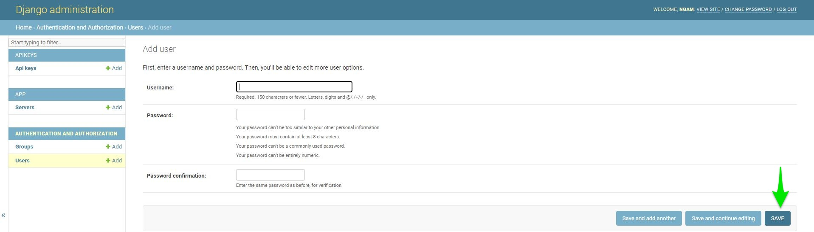

=====================
Installation and Setup
=====================
This section will guide you through the steps necessary to install and set up ForensicVM on your system.

Installation Steps
------------------
.. _installation:

AutopsyVM Client Plugin Installation
===================================

Introduction
------------

The AutopsyVM client plugin is a valuable addition to Autopsy, enhancing its functionality for digital forensics. Follow the steps below to install the plugin.

Step 1: Download ForensicVM.exe Setup File
------------------------------------------

Download the latest version of the ForensicVM.exe setup file from the [AutopsyForensicVM GitHub Releases](https://github.com/nunomourinho/AutopsyForensicVM/releases) page. Navigate to the "Assets" section and download the setup file.

Step 2: Run the ForensicVM.exe Setup
-----------------------------------

Run the ForensicVM.exe setup file to begin the installation process. The setup consists of four steps:

1. Welcome Screen: Displays an introduction to the installation process.
2. Component Installation: Proceed with the default settings. Do not make any changes.
3. Plugin Location: Specify the location where the AutopsyVM client plugin will be installed. Typically, this does not require any changes.
4. Install: Click the "Install" button to start the installation process.

Step 3: Complete the Installation
-------------------------------

Follow the on-screen instructions to complete the installation. Once the installation is finished, you can proceed with using the AutopsyVM client plugin in Autopsy.

Step 4: Verify the Installation
------------------------------

To verify the successful installation of the AutopsyVM client plugin, open Autopsy and check if the plugin is available and functional.

Screenshots
-----------

Here are the screenshots that illustrate the installation process:

.. figure:: img/0001.JPG
   :alt: Welcome Screen
   :align: center

   Welcome Screen

.. figure:: img/0002.JPG
   :alt: Component Installation
   :align: center

   Component Installation

.. figure:: img/0003.JPG
   :alt: Plugin Location
   :align: center

   Plugin Location

   Finish Screen

Initial Setup
-------------
After successfully installing ForensicVM one needs to configure the AutopsyVM plugin. The initial configuration is composed of the following steps:

Step 1: In Autopsy: Add a new datasource to Autopsy. This new datasource is the forensic image that we need to convert to a forensicVM
----------------------------------------------------------------------------------------------------------------------------------------
 #. Add datasource
 #. Specify a new hostname
 #. Next

 .. figure:: img/setup_0001.jpg
    :alt: Add datasource
    :align: center

    Add a new datasource to Autopsy

Step 2: Select your Disk Image
--------------------------------
 #. Select option disk image or VM FIle
 #. Next

.. figure:: img/setup_0002.jpg
   :alt: Disk Image
   :align: center

   Disk Image

Step 3: Select your forensic image
------------------------------------
 #. Browse for you forensic image, select it
 #. Click Next

.. figure:: img/setup_0003.jpg
   :alt: Forensic Image Selection
   :align: center

   Forensic Image Selection

Step 4: Run the ForensicVM client plugin
------------------------------------------
 #. Deselect all other plugins
 #. Select the forensicVM Client plugin
 #. Click next

.. figure:: img/setup_0004.jpg
   :alt: Select datasource
   :align: center

   Select Datasource

Step 5: Open yout forensicVM Server web address in admin. Ex: https://<ip-or-web>:port/admin
----------------------------------------------------------------------------------------------
 #. Enter user and password
 #. Click the login button

.. figure:: img/setup_0005.jpg
   :alt: Configure inject
   :align: center

   Configure inject - Select ForensicVM Client plugin

Step 6: Add  a new user
------------------------
 #. Enter user, password and password confirmation dialogs
 #. Click SAVE

   Add user

Step 7: Add  a new api key to the user
---------------------------------------
 #. Click the add button on the api keys
 #. Select the user
 #. Click the plus sign

.. figure:: img/setup_0007.jpg
   :alt: Add api key to user
   :align: center

   Add api key to user

Step 8: Copy user api key
------------------------------------
 #. Select the newly created api key
 #. Press CTRL + C or copy it using the right mouse button and select copy

.. figure:: img/setup_0008.jpg
   :alt: Copy user api key
   :align: center

   Copy user api key

Step 9: Paste user api key
------------------------------------
 #. Put mouse on the Forensic API field
 #. Press CTRL + V or paste it using the right mouse button and select paste

.. figure:: img/setup_0009.jpg
   :alt: Past user api key
   :align: center

   Paste user api key

Step 10: Fill and test Forensic VM Server configuration
-------------------------------------------------------
 #. Put mouse on the Forensic VM server address. Fill the information with your server address
 #. Click the Test Server Connection to test if API and server address are correct

.. figure:: img/setup_0010.jpg
   :alt: Fill and test forensic VM
   :align: center

   Fill and test forensic VM Server Configuration

Step 11: Forensic VM Server configuration test success
-------------------------------------------------------
 #. If all informations is correct and if the server is online you should see a connected sucessufully dialog box.
 #. If there are any problems, you should see an red error dialog. Please check and correct the field values.

   Forensic VM server connection test

Step 12: Configure Windows Share over Forensic SSH Server Redirection
----------------------------------------------------------------------
 The way that forensicVM Server access the forensic images is by making a reverse ssh connection to your computer and access a local share via internet. The reverse ssh connection is in need to make a safe windows share access. You should configure now the forensicVM server SSH address and port number:
 #. Please fill the SSH Server Address and port number.
 #. Press the button copy ssh key to server

.. figure:: img/setup_0012.jpg
   :alt: Configure and copy SSH key to server
   :align: center

   Configure and copy ssh key to server

Step 13: Windows Share over Forensic SSH copy ssh key status
------------------------------------------------------------- 
 #. If the configuration is correct you should see a dialog stating that a Public key added to authorized keys
 #. If not, you should see a error dialog or a dialog stating that the ssh public key is already present on the remote server

   Copy ssh key status

Step 14: Testing Windows Share over Forensic SSH Server Redirection
---------------------------------------------------------------------- 
 #. Click the Test Ssh connection button
 #. If the configuration is correct you should see a dialog stating that the connection was successfull
 #. If not, you should see a error dialog

.. figure:: img/setup_0014.jpg
   :alt: Test windows share over ssh
   :align: center

   Test windows share over ssh

Step 15: Configure windows share over ssh
---------------------------------------------------------------------- 
 #. Press the Autofill info button to autofill the windows share information withe the Share login and local ou remote path to share. This info is extracted from the forensic image current path.

.. figure:: img/setup_0015.jpg
   :alt: Configure windows share over ssh
   :align: center

   Configure windows share over ssh

Step 16: Configure the share login and the share password
---------------------------------------------------------------------- 
 #. The share login and share password is a windows local user and is password. It does not need to be an Administrator accound. It can be a regular user. It also does not need to exist, since it is created if it does not exits when the user press the create share button.

.. figure:: img/setup_0016.jpg
   :alt: Configure the share login and the share password
   :align: center

   Share login and the share password configuration

Step 17: 
---------------------------------------------------------------------- 
 #. 

.. figure:: img/setup_0017.jpg
   :alt: Welcome Screen
   :align: center

   Welcome Screen

.. figure:: img/setup_0018.jpg
   :alt: Welcome Screen
   :align: center

   Welcome Screen

   Welcome Screen
