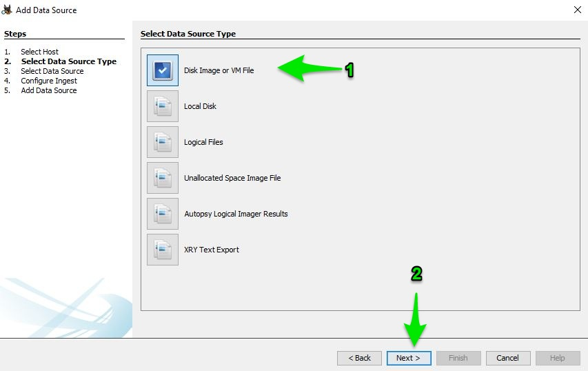
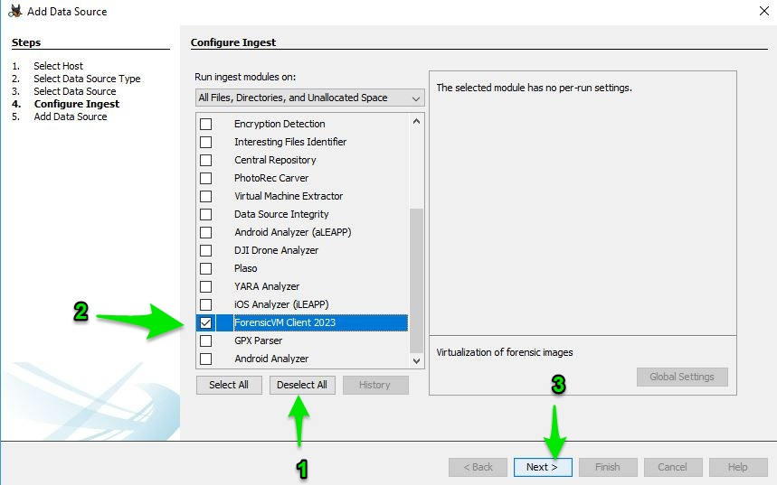
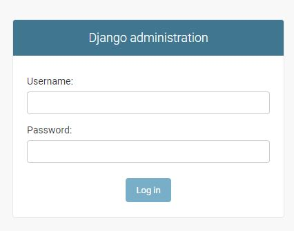
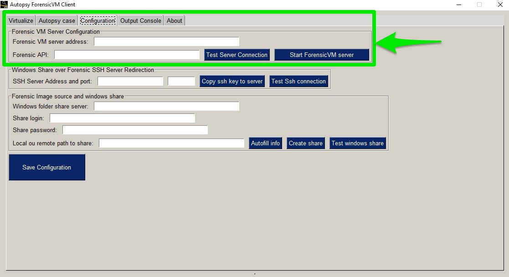
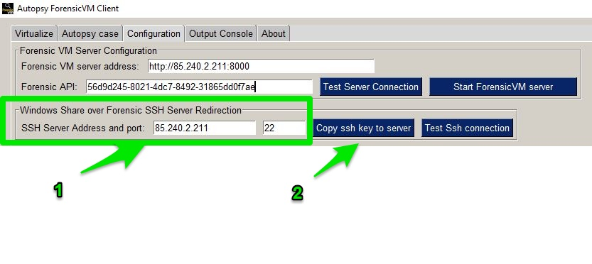

======================
ForensicVM: Installation and Setup Guide
======================

This comprehensive guide will walk you through the entire process of installing and setting up ForensicVM on your system. ForensicVM is a tool designed to assist in digital forensic investigations by providing a dedicated forensic hypervisor server equipped with the necessary tools and resources.

.. _installation:

=============================
ForensicVM Client Plugin Installation
=============================

The AutopsyVM client plugin is a beneficial enhancement to Autopsy's functionality in the field of digital forensics. This section presents a step-by-step guide on installing the plugin, verifying its installation, and showcasing the process using screenshots.

----------------------
Step 1: Download ForensicVM.exe Setup File
----------------------

Start the installation process by downloading the latest version of the ForensicVM.exe setup file from the [AutopsyForensicVM GitHub Releases](https://github.com/nunomourinho/AutopsyForensicVM/releases) page. The setup file is located under the "Assets" section.

----------------------
Step 2: Run the ForensicVM.exe Setup
----------------------

Launch the ForensicVM.exe setup file to begin the installation. This part of the process consists of four steps:

1. Welcome Screen: A brief introduction to the installation process is displayed.
2. Component Installation: Proceed with the default settings and avoid making any changes.
3. Plugin Location: Specify the directory where the AutopsyVM client plugin will be installed. Typically, the default location does not require any changes.
4. Install: Click the "Install" button to initiate the installation process.

----------------------
Step 3: Complete the Installation
----------------------

Follow the prompts provided to complete the installation. After the process is finalized, you can proceed to use the AutopsyVM client plugin with Autopsy.

----------------------
Step 4: Verify the Installation
----------------------

To ensure the AutopsyVM client plugin has been successfully installed, open Autopsy and check if the plugin is available and operational.

----------------------
Screenshots
----------------------

Below are screenshots that provide a visual guide for the installation process:

.. figure:: img/0001.JPG
   :alt: Welcome Screen
   :align: center

   Welcome Screen

.. figure:: img/0002.JPG
   :alt: Component Installation
   :align: center

   Component Installation

.. figure:: img/0003.JPG
   :alt: Plugin Location
   :align: center

   Plugin Location

.. figure:: img/0004.JPG
   :alt: Finish Screen
   :align: center

   Finish Screen

==========================
Initial Setup of AutopsyVM Plugin
==========================

After successfully installing ForensicVM, it's crucial to configure the AutopsyVM plugin. The initial configuration process consists of several steps, ranging from adding a new data source to testing the server connection and setting up the Windows share over Forensic SSH Server Redirection. Each step is detailed below with corresponding screenshots for better understanding:

----------------------
Step 1: Add a New Data Source in Autopsy
----------------------

1. Navigate to "Add data source".
2. Specify a new hostname.
3. Click "Next".

   Adding a new data source in Autopsy

----------------------
Step 2: Select Your Disk Image
----------------------

1. Choose the option "Disk image or VM file".
2. Click "Next".

   Disk Image Selection

----------------------
Step 3: Choose Your Forensic Image
----------------------

1. Browse your files and select your forensic image.
2. Click "Next".

.. figure:: img/setup_0003.jpg
   :alt: Forensic Image Selection
   :align: center

   Forensic Image Selection

----------------------
Step 4: Run the ForensicVM Client Plugin
----------------------

1. Deselect all other plugins.
2. Select the "ForensicVM Client" plugin.
3. Click "Next".

   Selecting ForensicVM Client Plugin

----------------------
Step 5: Open Your ForensicVM Server Web Address in the Admin
----------------------

1. Enter your username and password.
2. Click the "Login" button.

   Logging in to ForensicVM Server Admin

----------------------
Step 6: Add a New User
----------------------

1. Fill in the username, password, and password confirmation dialogues.
2. Click "SAVE".

.. figure:: img/setup_0006.jpg
   :alt: Add New User
   :align: center

   Adding a New User

----------------------
Step 7: Add a New API Key to the User
----------------------

1. Click the "Add" button under the API keys section.
2. Select the user.
3. Click the plus sign.

.. figure:: img/setup_0007.jpg
   :alt: Add API Key to User
   :align: center

   Adding API Key to User

----------------------
Step 8: Copy the User API Key
----------------------

1. Select the newly created API key.
2. Press CTRL + C or copy it using the right mouse button and select "Copy".

.. figure:: img/setup_0008.jpg
   :alt: Copy User API Key
   :align: center

   Copying User API Key

----------------------
Step 9: Paste the User API Key
----------------------

1. Place the cursor on the "Forensic API" field.
2. Press CTRL + V or paste it using the right mouse button and select "Paste".

   Pasting User API Key

----------------------
Step 10: Fill and Test the Forensic VM Server Configuration
----------------------

1. Fill in the "Forensic VM Server Address" with your server address.
2. Click the "Test Server Connection" to check if the API and server address are correctly entered.

.. figure:: img/setup_0010.jpg
   :alt: Fill and Test Forensic VM Server Configuration
   :align: center

   Filling and Testing Forensic VM Server Configuration

----------------------
Step 11: Confirm Forensic VM Server Configuration Test Success
----------------------

If all the information entered is correct and the server is online, a "Connected Successfully" dialog box will appear. In case of any issues, a red error dialogue will appear, prompting you to check and correct the field values.

.. figure:: img/setup_0011.jpg
   :alt: Forensic VM Server Connection Test Success
   :align: center

   Forensic VM Server Connection Test Success

----------------------
Step 12: Configure Windows Share over Forensic SSH Server Redirection
----------------------

ForensicVM Server accesses forensic images via a reverse SSH connection to your computer, allowing local share access over the internet. At this step, you should configure the ForensicVM server SSH address and port number:

1. Fill in the SSH Server Address and port number.
2. Press the button to copy the SSH key to the server.

   Configuring Windows Share over Forensic SSH Server Redirection

.. NOTE::
   The following steps outline the process for creating a Windows share over SSH.

----------------------
Step 13: Configure the Share Login and the Share Password
----------------------

Ensure to use a secure Windows username and password for your share. Even though the share is protected over the internet by your SSH private key, on the Windows network, your username and password could be a potential vulnerability. We recommend a dedicated, strong username and password for your share.

.. figure:: img/setup_0013.jpg
   :alt: Configure the Share Login and Share Password
   :align: center

   Configuring the Share Login and Share Password

.. CAUTION::
   Configure your firewall to allow local access to your Windows shares. You can restrict the Windows share to be accessible only by your own computer. If needed, consult your system administrator to perform this task.

----------------------
Step 14: Press 'Create Share' Button
----------------------

After confirming the share login and password, press the "Create Share" button to proceed.

.. figure:: img/setup_0014.jpg
   :alt: Create Share
   :align: center

   Creating Share

----------------------
Step 15: Confirm 'Create Share' Dialogue
----------------------

A dialogue box will confirm the successful creation of the share. Press "OK" to proceed.

.. figure:: img/setup_0015.jpg
   :alt: Confirm Create Share
   :align: center

   Confirming Create Share

----------------------
Step 16: Test the ForensicVM Image Windows Share over SSH
----------------------

At this step, you should confirm that the Windows Share over SSH is working correctly:

1. Press the "Test Share" button.
2. A green checkmark will appear next to the "Test Share" button if the test is successful.

   Testing the ForensicVM Image Windows Share over SSH

With this, you have successfully completed the installation and initial setup of ForensicVM. You can start investigating!

.. CAUTION::
   Ensure to use a secure Windows username and password for your share. Although this share is protected over the internet by your SSH private key, on the Windows network, your username and password could be a potential vulnerability. We recommend a dedicated, strong username and password for your share, which can be reused for multiple forensic image shares if necessary.

.. NOTE::
   Please configure your firewall to allow local access to your Windows shares. You can restrict the Windows share to be accessible only by your own computer. If needed, please seek assistance from your system administrator to perform this task.
