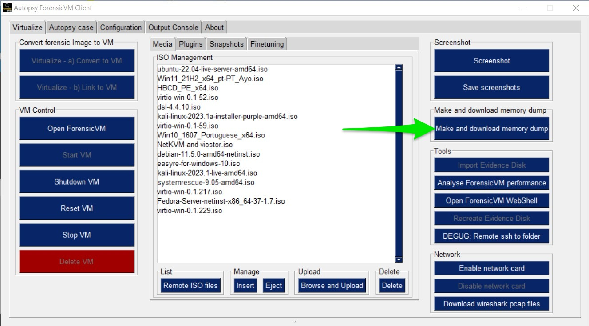
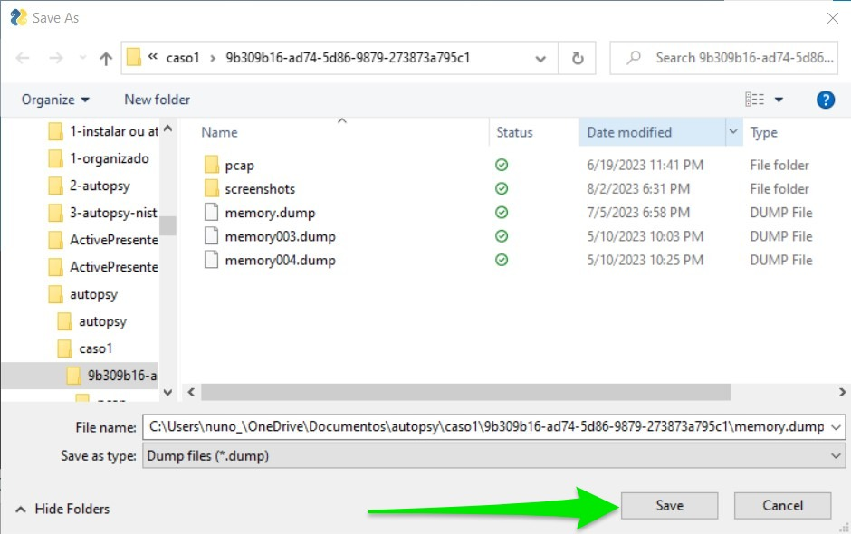

Making, Downloading, and Analyzing a Memory Dump (memory_dump_vm)
=================================================================

Making a Memory Dump
*********************
Making a memory dump refers to the process of capturing the content of a computer's memory (RAM) at a specific moment in time. This snapshot can include various elements, ranging from currently running processes to user credentials and even the contents of open files. The practice is critical for several reasons:

Security Analysis
-----------------
In the realm of cybersecurity, memory dumps have become an essential tool. Here's how they contribute:

- **Uncovering Malware Behavior**: Memory dumps allow security professionals to see what is happening inside the system's memory, including hidden or obfuscated malware activities. By analyzing these dumps, one can reveal the behavior of malicious code, tracking its origin, and how it interacts with the system.
- **Detecting Hidden Processes**: Sophisticated malware often hides from standard detection methods. Memory analysis helps in uncovering these hidden processes, providing a more transparent view of unauthorized activities.
- **Injected Code Analysis**: Attackers may inject malicious code into legitimate processes to conceal their actions. A memory dump helps in identifying these code injections, leading to better understanding and mitigation of such threats.
- **User Credential Analysis**: Sometimes, credentials might be stored in memory. A memory dump could reveal these details, helping in understanding potential security breaches or vulnerabilities.

Forensic Analysis
-----------------
Digital forensic analysts often use memory dumps to investigate suspicious or malicious activities:

- **Timeline Analysis**: Memory dumps can provide a chronological view of the activities that transpired on the device, aiding in reconstructing events leading up to an incident.
- **Data Recovery**: Even if data is deleted or encrypted, remnants might still exist in the system's memory. Analyzing memory dumps may allow the recovery of this vital information.
- **Artifact Analysis**: Various artifacts related to user activities, system interactions, and file usage can be extracted and analyzed from memory dumps, painting a comprehensive picture of user behavior.

Legal Evidence
--------------
In the context of legal proceedings, memory dumps might provide crucial evidence:

- **Computer Usage**: Evidence regarding the usage of specific applications or accessing specific files or websites can be derived from a memory dump.
- **Unauthorized Access**: In cases of hacking or unauthorized access, memory dumps may hold evidence of the intrusion, including the tools used and the data targeted.
- **Intellectual Property Theft**: If there is a suspicion of intellectual property theft, memory dumps can reveal whether sensitive documents were accessed, modified, or transferred.

Making and Downloading a Memory Dump
====================================
Follow the steps below to make and download a memory dump:

1) Press the "Make and Download Memory Dump" Button
---------------------------------------------------
Press the button labeled "Make and Download Memory Dump" to initiate the process.

   Press "Make and Download Memory Dump" button

2) Save the Memory Dump on the Default ForensicVM Image Case Path
-----------------------------------------------------------------
Choose the default forensicVM image case path to save the memory dump.

   Save the memory dump

3) Monitor Memory Download Progress with Time Estimation
-------------------------------------------------------
Keep track of the download progress, including an estimated time remaining for the download to complete.

   Memory Download progress

4) Success Message Stating that the Memory was Saved as "memory.dump"
--------------------------------------------------------------------
A success message will appear, stating that the memory was saved as "memory.dump." The explorer will automatically open afterward.

   Success message

5) Windows Explorer Open on the Memory Dump Folder
--------------------------------------------------
The Windows explorer will open automatically, displaying the folder containing the memory dump.

   Windows explorer open on the memory dump folder
